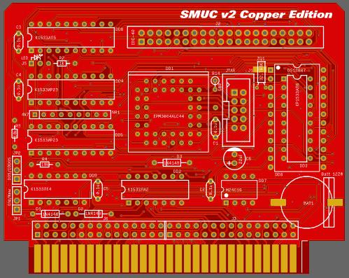

# SMUC2

Оцифрованная мной в EasyIDA схема контроллера SMUC2.

Схема, практически соответствует оригинальным герберам с исправлением замеченных ошибок. 
Печатная плата немного доработана, укорочены дорожки, передвинуты некоторые элементы, для более удобного монтажа, плата залита земляными полигонами.
Шаг ламелей краевого разъема 2.54мм под современные разъемы SL60 и SL62.

[Схема и печатная плата](Export)

[Герберы](Gerbers)

[Исходники для EasyEDA](Sources)
