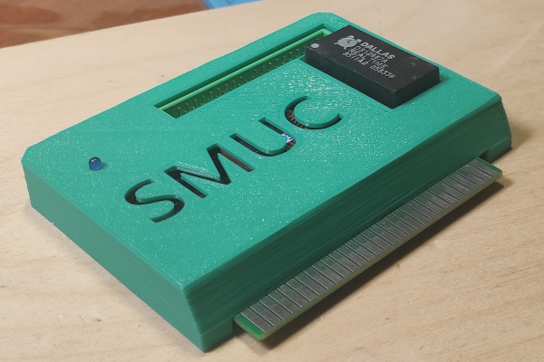

# SMUC2

Декоративная крышка для платы SMUC2 в формате STL. Подходит только для моей версии платы, на других не проверял.

Отпечатана на 3D-принтере:
* Пластик: PLA
* Сопло: 0.4мм
* Слой: 0.2мм
* Печать без поддержек, буквами SMUC вниз к столу.

